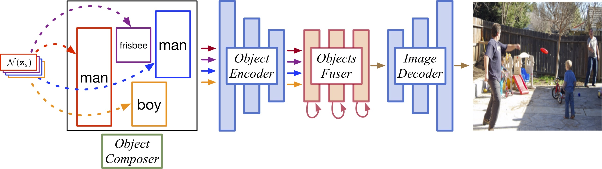
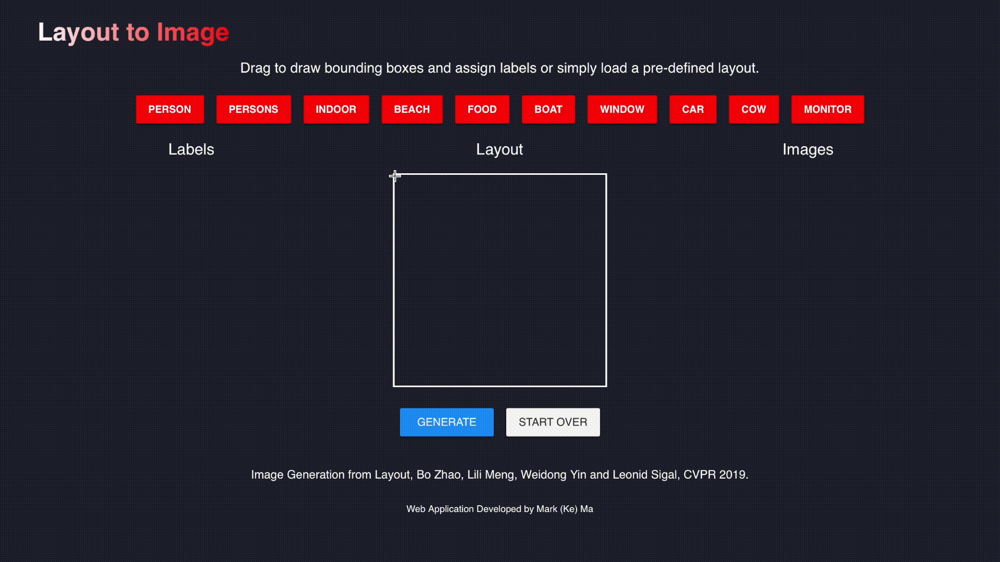
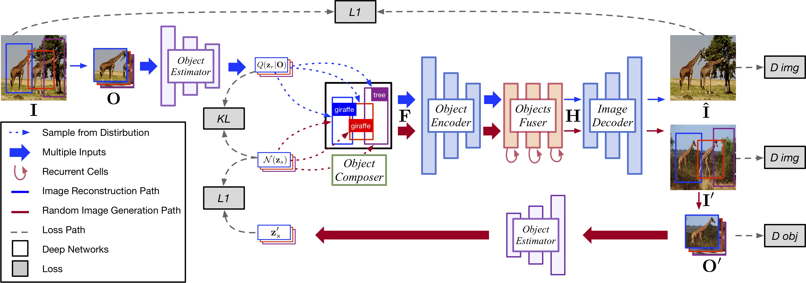
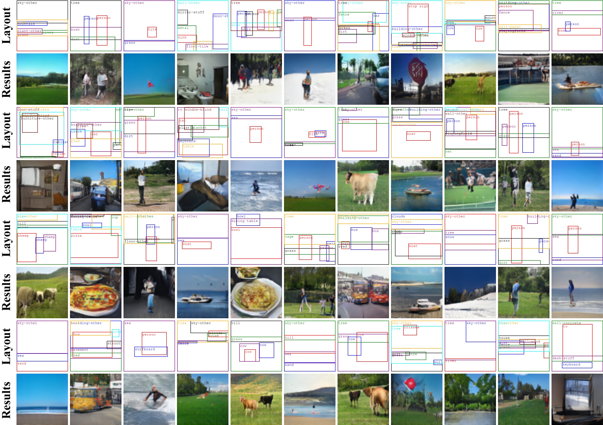
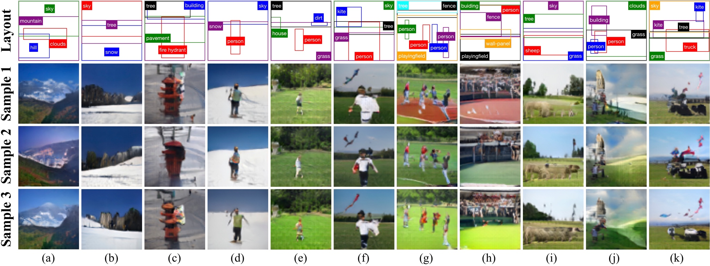
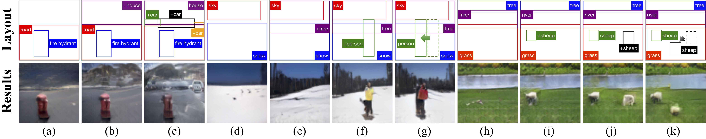

# layout2im 

This repository provides a PyTorch implementation of [layout2im](https://arxiv.org/abs/1811.11389), which can generate images from layouts.

<p align="center"></p>

Online demo can be found [here](https://layout2im.cs.ubc.ca).
<p align='center'></p>

## Paper
[Image Generation from Layout](https://arxiv.org/abs/1811.11389)
<br/>
[Bo Zhao](https://zhaobo.me)<sup>1</sup>, [Lili Meng](https://www.borealisai.com/en/team/lili-meng/)<sup>1</sup>,[Weidong Yin](http://scholar.google.com/citations?user=kHblmyAAAAAJ&hl=en)<sup>1</sup>, [Leonid Sigal](https://www.cs.ubc.ca/~lsigal/)<sup>1,2</sup><br/>
<sup>1 </sup> The Univerisity of British Columbia, <sup>2 </sup> Vector Institute <br/>
IEEE Conference on Computer Vision and Pattern Recognition ([CVPR](http://cvpr2019.thecvf.com/)), 2019, (<b>Oral</b>)

## Network Architechture

Overview of our Layout2Im networks for generating images from layout during training.

<p align='center'></p>

## Usage

### 1. Creating virtual environment (optional)
All code was developed and tested on Ubuntu 18.04 with Python 3.6 (Anaconda) and PyTorch 1.0.

```bash
$ conda create -n layout2im python=3.6
$ conda activate layout2im
```

### 2. Install COCO API
```bash
$ cd ~
$ git clone https://github.com/cocodataset/cocoapi.git
$ cd cocoapi/PythonAPI/
$ python setup.py install
$ cd ..
```

### 3. Cloning the repository
```bash
$ git clone git@github.com:zhaobozb/layout2im.git
$ cd layout2im
```

### 4. Installing dependencies
```bash
$ pip install -r requirements.txt
```

### 5. Downloading datasets

To download [COCO](http://cocodataset.org) dataset to `datasets/coco`:
```bash
$ bash scripts/download_coco.sh
```

To download [Visual Genome](https://visualgenome.org) dataset to `datasets/vg` and preprocess it:
```bash
$ bash scripts/download_vg.sh
$ python scripts/preprocess_vg.py
```

### 6. Downloading trained models
Download the trained models to `checkpoints/pretrained/`.
1. [trained model on COCO](https://drive.google.com/open?id=1Zgy1OzAhMH9aSyC2DxL2DDqKav-G8YnW)
2. [trained model on Visual Genome](https://drive.google.com/open?id=1YoSsmxasZAVTFZ0QfuYXsmBtOAfGu5xj)

### 7. Testing

Testing on COCO dataset:
```bash
$ python layout2im/test.py --dataset coco --coco_dir datasets/coco \
                           --saved_model checkpoints/pretrained/netG_coco.pt \
                           --results_dir checkpoints/pretrained_results_coco
```

Testing on Visual Genome dataset:
```bash
$ python layout2im/test.py --dataset vg --coco_dir datasets/vg \
                           --saved_model checkpoints/pretrained/netG_vg.pt \
                           --results_dir checkpoints/pretrained_results_vg
```

### 8. Training

```bash
$ python layout2im/train.py
```

The training script has a number of command-line flags that you can use to configure the model architecture, hyperparameters, and input / output settings:
- `dataset`: The dataset to use for training; must be either `coco` or `vg`. Default is `coco`.
- `vg_dir`: The directory of visual genome dataset. Default is `datsets/vg`.
- `coco_dir`: The directory of coco dataset. Default is `dataset/coco`.
- `batch_size`: How many pairs of (layout, image) to use in each minibatch during training. . Default is 8.
- `niter`: How many iterations will the model be trained. Default is 300000.
- `image_size`: The size of images to generate. Default is 64.
- `object_size`: The size of object to be resized to. Default is 32.
- `embedding_dim`: Integer giving the dimension for the word embedding for objects category. Default is 64.
- `z_dim`: Integer giving the dimension for the appearance code for objects. Default is 64.
- `learning_rate`: Learning rate to use in Adam optimizer for the generator and discriminators. Default is 1e-4.
- `resi_num`: How many residual blocks are used before image decoder. Default is 6.
- `clstm_layers`: How many layers are used for convolutional lstm. Default is 3.
- `lambda_img_adv`: The weight to assign to adversarial loss for image. Default is 1.0.
- `lambda_obj_adv`: The weight to assign to adversarial loss for object. Default is 1.0.
- `lambda_obj_cls`: The weight to assign to auxiliary loss for object classification. Default is 1.0.
- `lambda_z_rec`: The weight to assign to appearance code regression. Default is 10.0.
- `lambda_img_rec`: The weight to assign to image reconstruction loss. Default is 1.0.
- `lambda_kl`: The weight to assign to KL divergence. Default is 0.01.
- `resume_iter`: Which iteration to resume from; must be either `l`, `s` or the integer of previously saved iteration. `l` means training from latest saved model, `s` means training from scratch. Default is `s`.
- `log_step`: How many steps to print log information. Default is 10.
- `tensorboard_step`: How many steps to update tensorboard. Default is 100.
- `save_step`: How many steps to save models. Default is 1000.
- `use_tensorboard`: Whether to use tensorboard. Default is `true`.

## Results

### 1. Images generated from layouts

<p align='center'></p>

### 2. Diverse results generated from the same layout

<p align='center'></p>

### 3. Examples of interactive image generation

<p align='center'></p>

## Citation

If you find this code useful in your research then please cite
```
@inproceedings{zhaobo2019layout2im,
  title={Image Generation from Layout},
  author={Zhao, Bo and Meng, Lili and Yin, Weidong and Sigal, Leonid},
  booktitle={CVPR},
  year={2019}
}
```

## Acknowledgement 
Our project borrows some source files from [sg2im](https://github.com/google/sg2im). 
We thank the authors. This research was partially supported by NSERC Discovery, NSERC DAS, NSERC CFI grants and Mitacs GlobaLink Award. 
We gratefully acknowledge the support of NVIDIA Corporation with the donation of the Titan V GPU used for this research.